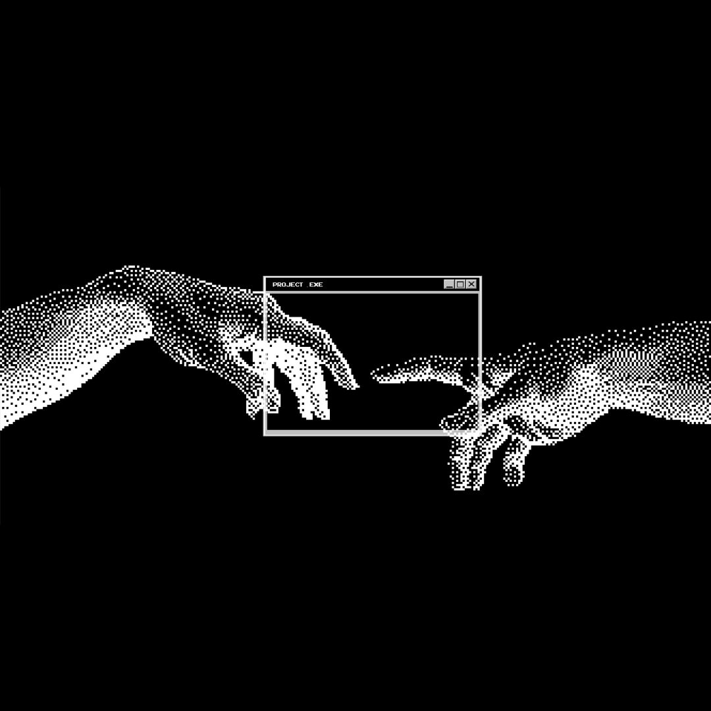

# Hi 👋, I'm Malika Akmalovna

  

### Frontend Developer

---

### 🚀 About Me

I'm a **Frontend Developer** passionate about building clean, responsive, and pixel-perfect web interfaces.

- 🔭 Currently improving my skills in **HTML, CSS & JavaScript**
- 🎨 I love converting **Figma designs** into functional websites
- 🌱 Learning modern frontend workflows and best practices
- 💬 Always open to new projects and collaborations

---

### 🌐 Connect with me

---

### 💻 Tech Stack

---

### 📊 GitHub Stats

---

### 📈 Activity Graph

---

⭐️ Thanks for visiting my profile!

## Hi there 👋

<!--
**MalikaUralova/MalikaUralova** is a ✨ _special_ ✨ repository because its `README.md` (this file) appears on your GitHub profile.

Here are some ideas to get you started:

- 🔭 I’m currently working on ...
- 🌱 I’m currently learning ...
- 👯 I’m looking to collaborate on ...
- 🤔 I’m looking for help with ...
- 💬 Ask me about ...
- 📫 How to reach me: ...
- 😄 Pronouns: ...
- ⚡ Fun fact: ...
-->
